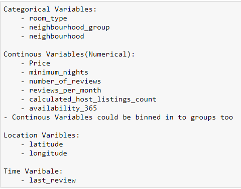

# Airbnb New York (2019) Analysis

## Problem Statement
Suppose you are working as a data analyst at Airbnb. The Covid-19 pandemic has severely impacted Airbnb's business, resulting in a decline in revenue. With the easing of restrictions and the reopening of travel, Airbnb is eager to make a successful comeback. 

As a data analyst, your goal is to analyse data from property listings on Airbnb in New York from 2019 to derive insights and formulate recommendations to improve the company's revenue post-lockdown. You will utilise data analysis and data visualisation techniques you have learned in previous modules to provide valuable information to assist Airbnb in making informed decisions for its business revival.

## Audience
The primary audience for the analysis is the executive team at Airbnb. This includes key decision-makers and stakeholders responsible for strategizing the company's post-lockdown comeback. The executives are interested in data-driven insights that can guide decisions related to property listings, customer preferences, and overall revenue generation.

## End Product
The outcome of your data analysis will be a data analysis report presentation. This report will include visualisations, key insights, and actionable recommendations for the executive team to consider in their post-lockdown revival strategy.
 
**Data:**
- New York Airbnb’s Dataset
- Column Types
  

- Variable Types
  

## Tableau Viz
[Airbnb New York Data (2019) Analysis by Kamal](https://public.tableau.com/views/AirbnbDataAnalysis_17132794271210/NeighbourhoodConcentration?:language=en-US&:sid=&:display_count=n&:origin=viz_share_link)

## Conclusion (Takeaways)
### 1. Neighbourhoods & Room Types
#### a. Focus on Manhattan and Brooklyn
These areas have the highest concentration of listings, bookings, and reviews, indicating higher demand. Tailor marketing strategies to these areas.

#### b. Diversify offerings in Queens and Bronx
Consider campaigns to incentivize entire home/apartment listings in these boroughs to cater to longer stays. 

### 2. Price & Availability
### 3. Understanding User Preferences
### 4. Post-Pandemic Considerations
